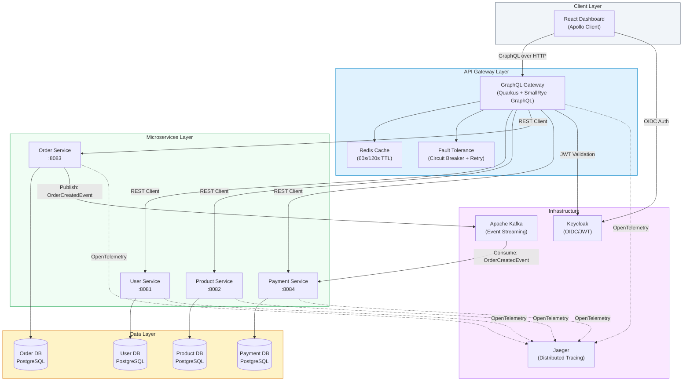
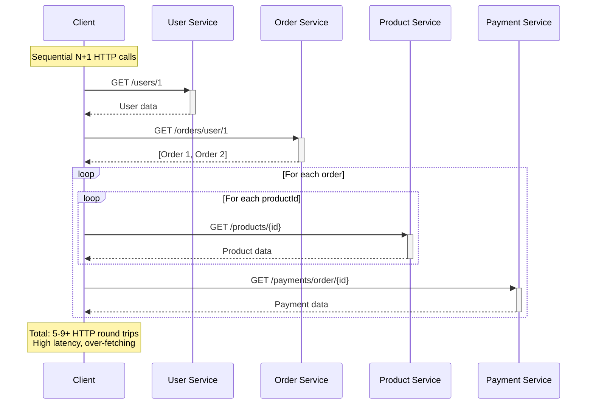
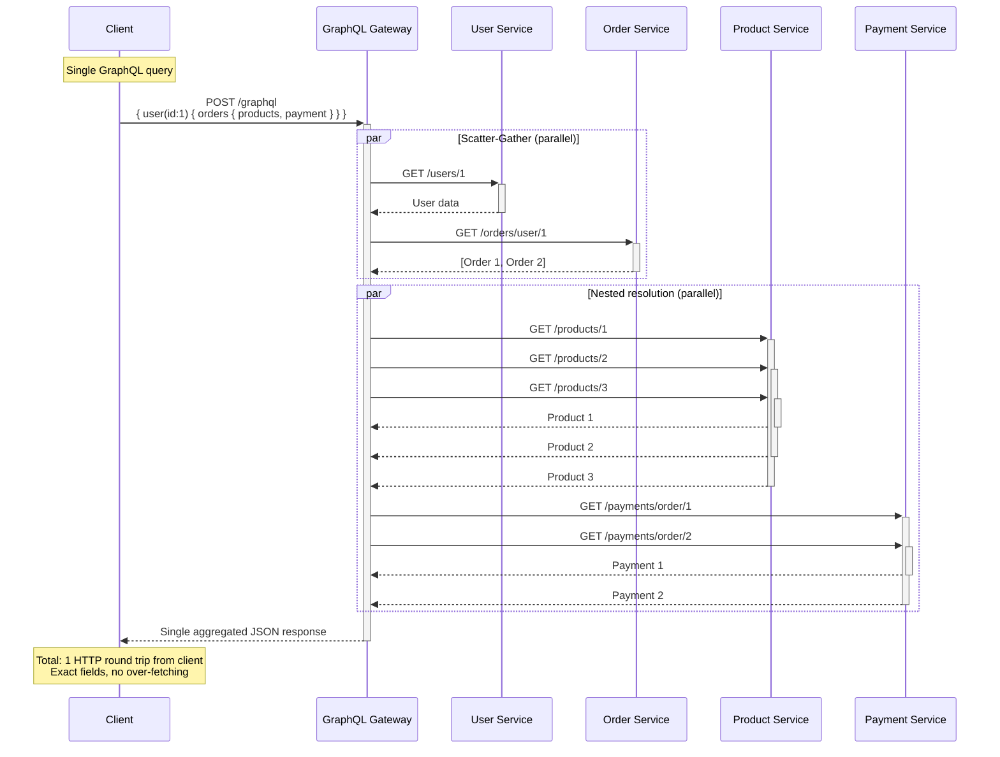
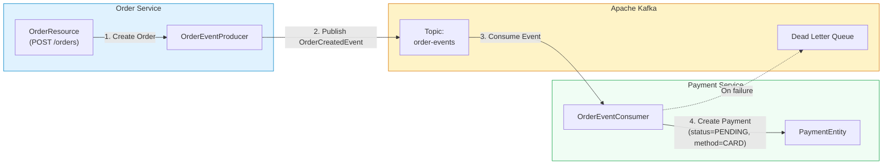
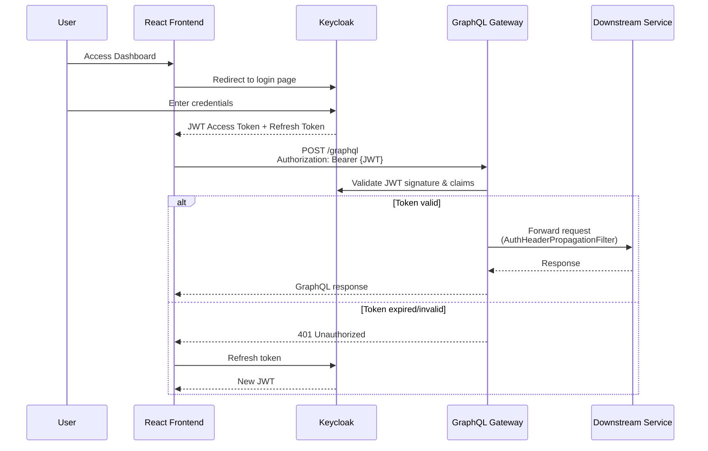
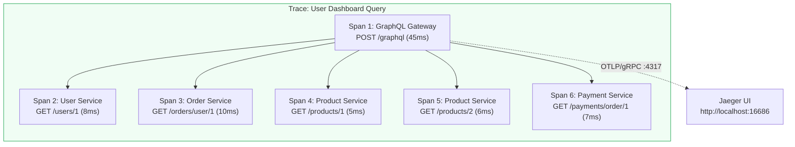
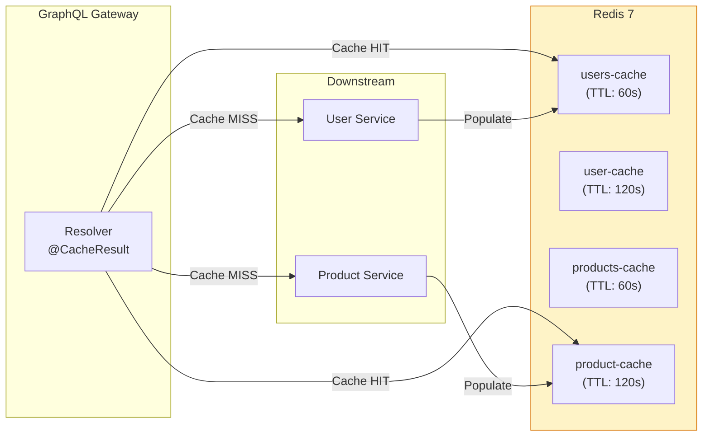
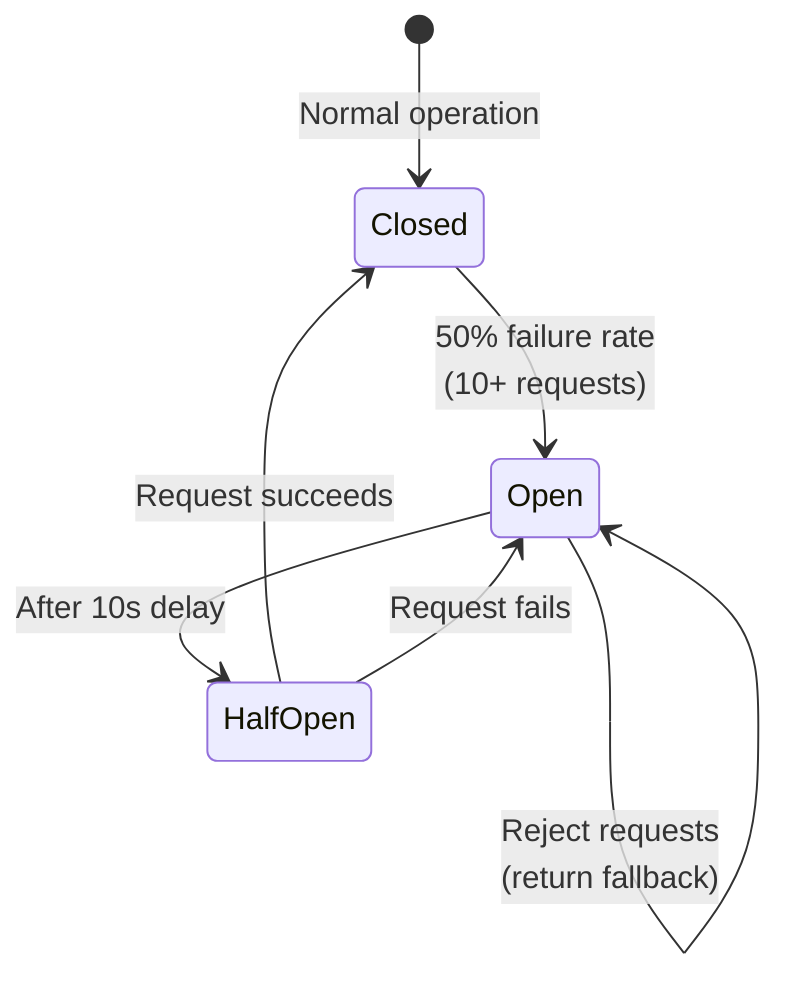

# QuarkGate — Architecture Documentation

**M.Tech Thesis: GraphQL Gateway Aggregation Pattern for Microservices**

---

## 1. System Architecture Overview



---

## 2. REST Waterfall vs GraphQL Aggregation

### 2.1 REST Waterfall Pattern (Problem)



### 2.2 GraphQL Gateway Aggregation (Solution)



---

## 3. Kafka Event-Driven Architecture



### Event Payload: OrderCreatedEvent
```json
{
    "orderId": 5,
    "userId": 1,
    "totalAmount": 99.99,
    "status": "PENDING",
    "createdAt": "2026-02-16T12:00:00",
    "productIds": [1, 2]
}
```

**Key Design Decisions:**
- **Idempotent Consumer:** Payment service checks if payment already exists for an orderId before creating
- **Dead Letter Queue:** Failed events are routed to DLQ for manual inspection
- **Asynchronous Processing:** Order creation returns immediately; payment is created asynchronously

---

## 4. Keycloak Authentication Flow



**OIDC Configuration:**
- **Realm:** `quarkgate`
- **Client ID:** Configured in Keycloak admin console
- **Token Propagation:** `AuthHeaderPropagationFilter` forwards JWT from gateway to downstream services
- **Public Endpoints:** `/graphql`, `/q/*` (health, metrics) are accessible without authentication

---

## 5. Distributed Tracing with Jaeger



**OpenTelemetry Configuration:**
- **Protocol:** OTLP over gRPC (port 4317)
- **Sampling:** Always-on (100%) for development/thesis evaluation
- **Propagation:** W3C TraceContext headers propagated across all services
- **Visualization:** Jaeger UI shows complete request waterfall with timing breakdown

---

## 6. Redis Caching Strategy



| Cache Name | TTL | What's Cached |
|:--|:--:|:--|
| `users-cache` | 60s | List of all users |
| `user-cache` | 120s | Individual user by ID |
| `products-cache` | 60s | List of all products |
| `product-cache` | 120s | Individual product by ID |

---

## 7. Fault Tolerance Pattern



**Configuration per Resolver:**
| Parameter | Value | Purpose |
|:--|:--:|:--|
| Timeout | 5000ms | Prevent hanging requests |
| Retry | 3 attempts, 200ms delay | Handle transient failures |
| Circuit Breaker threshold | 10 requests | Minimum sample size |
| Failure ratio | 50% | Trip threshold |
| Recovery delay | 10s | Cool-down period |
| Fallback | Empty list / null | Graceful degradation |

---

## 8. Technology Stack Summary

| Layer | Technology | Version | Purpose |
|:--|:--|:--:|:--|
| **Frontend** | React + Vite | 19.2 / 7.3 | Single-page dashboard |
| **GraphQL Client** | Apollo Client | 4.1 | GraphQL queries + cache |
| **API Gateway** | Quarkus + SmallRye GraphQL | 3.17.2 | Query aggregation |
| **Microservices** | Quarkus (REST) | 3.17.2 | Domain services |
| **Database** | PostgreSQL | 16 | Per-service data store |
| **Cache** | Redis | 7 | Distributed caching |
| **Messaging** | Apache Kafka | 7.5 (Confluent) | Event streaming |
| **Identity** | Keycloak | 23.0 | OIDC / JWT auth |
| **Tracing** | Jaeger + OpenTelemetry | 1.62 | Distributed tracing |
| **Testing** | JUnit 5 + REST-assured + Vitest | - | Backend + frontend tests |
| **Load Testing** | k6 (Grafana) | - | Performance benchmarks |
| **Containers** | Docker + Docker Compose | - | Local orchestration |
| **Orchestration** | Kubernetes | - | Production deployment |
